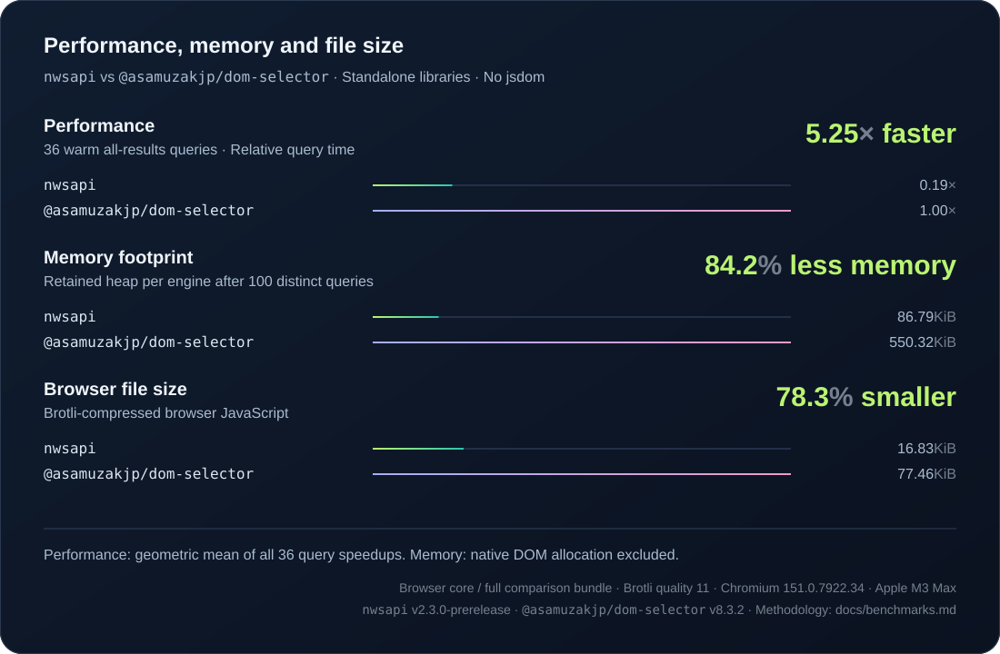

# [NWSAPI](http://dperini.github.io/nwsapi/)

<a href="https://badge.socket.dev/npm/package/nwsapi"></a>


Fast CSS selectors API engine with zero dependencies that works in Node.js and browsers.

NWSAPI builds on [NWMATCHER](https://github.com/dperini/nwmatcher) with [Selectors Level 4](https://drafts.csswg.org/selectors-4/) features such as `:is()`, `:where()`, and `:has()`, plus state selectors such as `:open` and `:modal`.
See the [selector support](https://github.com/dperini/nwsapi/wiki/CSS-supported-selectors) and [compatibility notes](https://github.com/dperini/nwsapi/wiki/Features-and-compliance).

## Performance

[](docs/benchmarks.md)

[Explore the benchmarks →](docs/benchmarks.md) · [Inside the compiler →](docs/performance.md)

## Install

```sh
pnpm add nwsapi
```

## In jsdom

Plug NWSAPI into jsdom for queries and stylesheet matching. Requires nwsapi ≥ 2.3.0 and jsdom ≥ 27.

<details>
<summary>Set up the dependency and override</summary>

Add the adapter's `css-tree` peer dependency to `package.json`:

```json
{
  "dependencies": {
    "css-tree": "^3.2.1"
  }
}
```

Replace `<version>` with the published nwsapi version you want to use.

- npm (`package.json`):

  ```json
  {
    "overrides": {
      "@asamuzakjp/dom-selector": "npm:nwsapi@<version>"
    }
  }
  ```

- pnpm (`pnpm-workspace.yaml`):

  ```yaml
  overrides:
    '@asamuzakjp/dom-selector': 'npm:nwsapi@<version>'
  ```

Install dependencies after the change.
The override does not change the NWSAPI factory API or add selector support.

</details>

<details>
<summary>Use the factory in Node.js</summary>

Node.js does not provide a DOM. This example creates one with jsdom.

```sh
pnpm add nwsapi jsdom
```

```js
const { JSDOM } = require('jsdom')
const createNwsapi = require('nwsapi')
const { window } = new JSDOM('<p class="item">Hello</p>')
const nw = createNwsapi(window)

const items = nw.select('.item', window.document)
window.close()
```

This example calls NWSAPI directly. It does not replace jsdom's selector engine.

</details>

## In browser

Load `src/nwsapi.js` from the package:

```html
<script src="nwsapi.js"></script>
<script>
  const items = NW.Dom.select('.item', document)
  const firstItem = NW.Dom.first('.item', document)
</script>
```

<details>
<summary>Replace native selector methods</summary>

`install()` changes selector methods such as `querySelectorAll()` and `matches()` for the page.
Use it only when you want those methods to call NWSAPI.

```js
NW.Dom.install()
// Restore the original methods when they are no longer needed.
NW.Dom.uninstall()
```

</details>

## API

See the [full API reference](docs/api.md) for all methods, options, and adapter APIs.

## Contribute

Use Node.js 26 and pnpm ≥ 12.3.4 to contribute.

```sh
pnpm install
pnpm test
```

The install sets up WPT and Chromium for browser tests. It needs Git and network access.
Node tests do not use the browser or WPT checkout.

<details>
<summary>Check changes before a push</summary>

```sh
pnpm run check
pnpm run test:package
```

Run `pnpm run fix` to apply lint fixes, format files, and check the result.
Run `pnpm run test:watch` to repeat Node tests while you edit files.

Run `pnpm run ci:local` to test the GitHub Actions workflow locally.
It needs Docker and GitHub CLI authentication. It pauses when a step fails.
CI uses one Node.js 26 job.

</details>

<details>
<summary>Run browser tests and measure coverage</summary>

```sh
pnpm run test:browser # Browser regressions and media states
pnpm run test:wpt     # Web Platform Tests
pnpm run cover        # Node + WPT coverage
```

Coverage combines Node tests and WPT in Chromium; all four aggregate metrics exceed 95%.
The CLI entry point has a separate 100% coverage assertion.
The coverage command checks the minimums in `.config/coverage.config.mts` and updates the badge.
CI also creates HTML reports. Known WPT failures remain visible in test results.

[Test setup and troubleshooting →](docs/upstream.md) · [Benchmarks →](docs/benchmarks.md)

</details>

<details>
<summary>Build the package and update dependencies</summary>

Rolldown builds JavaScript from the `.mts` source files and creates the minified browser file.
Run `pnpm run build` to build the files. Run `pnpm run clean` to remove generated JavaScript.

`pnpm pack` and `pnpm publish` build the package first.
Published files keep their existing paths, CommonJS API, browser and AMD support, and extension modules.
The package does not include TypeScript source files or development tools.

Pin development dependencies in the `pnpm-workspace.yaml` catalog. Update `pnpm-lock.yaml` when dependencies change.
Run `pnpm run update --check` to preview dependency updates.
Run `pnpm run update` to apply updates and refresh the lockfile.
Compiler tool versions need a separate compatibility review.
New dependency versions have a one-day release delay. Dependency scripts need explicit approval.
Use pnpm to install this repository; npm cannot install its catalog references.
CI reads Node.js and package manager versions from `.config/external-tools.json`.

</details>

## Support the project

Sponsorship helps fund maintenance, testing, and selector support.

<details>
<summary>Sponsorship and donation options</summary>

Use [GitHub Sponsors](https://github.com/sponsors/dperini), [Open Collective](https://opencollective.com/nwsapi), or [Patreon](https://www.patreon.com/dperini) for ongoing support.

You can also use [Ko-fi](https://ko-fi.com/dperini), [Buy Me a Coffee](https://www.buymeacoffee.com/dperini), or [Liberapay](https://liberapay.com/dperini).
Use [IssueHunt](https://issuehunt.io/r/dperini/nwsapi) to fund issues.

Corporate sponsors can ask about custom licensing, dedicated support, or priority fixes.

</details>
