# Selector benchmarks

See the [performance review and next priorities](performance-review.md) for
remaining gaps and the proposed acceptance bar for competitive performance.
The [common-query implementation notes](common-query-fast-paths.md) include
before/after measurements and a separate first-match benchmark.

Compare NWSAPI 2.2.27, 2.3.0-prerelease, and `@asamuzakjp/dom-selector`
in one run. The prerelease label identifies the current source, not a published release.

Extract the published baseline package, then run:

```sh
pnpm run bench --baseline /path/to/nwsapi-2.2.27/package
```

Results go to `assets/repo/bench/`. Each SVG contains at most four selectors
from one category. `results.json` records every timing sample, package
versions, source hashes, the fixture hash, and the test machine.

<details>
<summary>How measurements work</summary>

All engines use their default settings and query the same fixture in each group.
Before timing, Chromium checks
the same fixture. Each engine must return the same elements in the same order,
using their document positions to compare across hosts. Install Chromium with
`pnpm exec playwright install chromium` before the first run.
Unsupported selectors and incorrect results have no timing bar. A candidate
mismatch also makes the command fail.

The runner warms each query, rotates engine order between rounds, and reports
the median time per query. Lower is better. These measurements cover warm
queries, not browser performance, cold starts, or memory use. Results depend
on the machine and fixture; compare engines from the same run.
Labels show two decimal places. Bold marks the lowest unrounded median,
including exact ties. The raw samples keep their full precision.

Use `--rounds 3 --iterations 10 --output /tmp/nwsapi-bench` for a quick check.
Use the default nine rounds and 100 iterations for the recorded report.

</details>

<details>
<summary>Other measurements</summary>

The original selector presets, cache sweep, host-access checks, and memory
measurements are also available. Run `pnpm run build` first.

```sh
pnpm run bench:selectors --list
pnpm run bench:accessors --doc components
pnpm run bench:cache --limits 1000,4096
pnpm run bench:memory --count 200
```

The selector preset runner uses jsdom as a reference. Use `pnpm run bench`
for the browser-checked comparison charts. Cache and memory commands enable
garbage collection through the repository launcher.

</details>

## Component queries

Find controls inside repeated cards using classes, attributes, and relationships.
This generated fixture models component tests; it is not a production trace.



## Documentation queries

Find links, definition entries, and table cells in the existing specification-page fixture.
These queries exercise descendant and ancestor filtering on a larger document.



## Utility-class queries

Find navigation links and card content in the existing utility-class fixture.
It includes both narrow and broad containers to exercise traversal routing.



## Basic selectors



## Attribute selectors



## Relationships



## Position selectors



## Logical selectors



## Form state selectors


