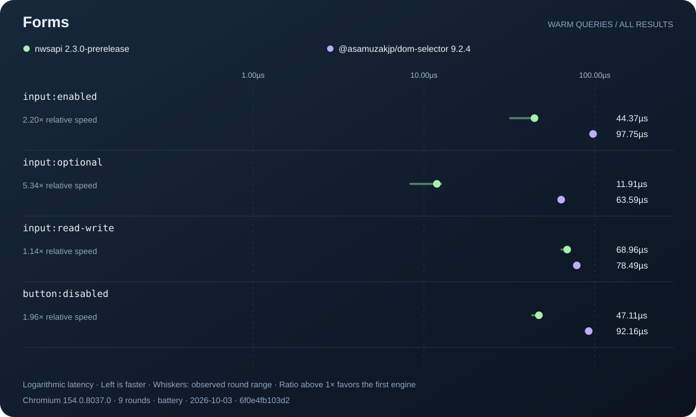

# Further v3 performance opportunities

Audited `prerelease/3.0.0` at `e988a9a` on October 3, 2026. The package manifest still labels this development build `2.3.0-prerelease`. The charts preserve that actual version and identify the bundle by SHA-256. This follow-up adds measurement and chart tooling. It does not change the selector runtime.

## Findings to act on

| Priority | Opportunity | Evidence | Next implementation and acceptance condition |
| --- | --- | --- | --- |
| 1 | Stream positions across mixed sibling types | A warm `main > :nth-of-type(2n)` query makes 4,102, 16,390 and 65,542 sibling reads for 64, 128 and 256 siblings with four alternating types. At 256 siblings of one type, it makes only 262 reads. | Replace repeated type-list reconstruction with a per-query parent table keyed by namespace and local name. Forward positions can use incremental counters. Reverse positions need totals or a reverse pass. Preserve the existing cheap homogeneous path and bound allocation to the query. |
| 2 | Make current `jsdom` implementation-node traversal available | The latest host supplies only `idlUtils`. The adapter's optional `domSymbolTree` readers are never installed through that constructor. | Probe implementation `parentElement`, `nextElementSibling` and `previousElementSibling` through the supplied utilities. Add `firstOf` only if measuring it justifies extending the reader contract. Keep the portable fallback and verify wrapper identity across realms, detached trees, fragments and adoption. |
| 3 | Reuse an attribute load within a pure compound | `[data-value^="foo"][data-value$="bar"]` performs two reads. `[data-value="foobar"][data-value]` performs one value read and one presence read. Exact duplicate equality tests already collapse to one read. | Give a compound a small attribute-load table. Load once, lazily after cheaper guards. Reuse only for the same element, namespace and name. Derive presence from `value !== null`, preserving empty values. Disable for extension or legacy semantics that can observe read order. |
| 4 | Reject irrelevant stylesheet rules before matching | A simple-class subject prototype lowers `check()` calls from 9,477 to 2,994 on 241 rules and 24 styled elements. | Coordinate stylesheet subject-cache invalidation with the host before enabling selective `extractSubjects()`. The current upstream mutation contract blocks a safe general rollout. See the reproduction below. |
| 5 | Balance sparse type-union merging | `lookup/tag.mts` merges each new collection into the accumulated output. Later merges recopy earlier nodes and repeat document-order comparisons. | Reuse the balanced-merge strategy already present for other selector groups. Start at four or more nonempty collections. Retain the existing dense broad-scan route and periodic density probe. Compare interleaved, disjoint, tiny, sparse and dense unions. |
| 6 | Share mixed-chain constants with the factory | `compile/mixed.mts` compiles recursive helper predicates without the outer compiler context. The greedy predicates receive that context. | Inspect emitted class/attribute expressions and hoist reusable regex constants into the factory prelude. Measure fallback-heavy misses separately from greedy hits. Audit helper-local variables and avoid making constants engine- or document-bound. |
| 7 | Compile expensive forms only after reuse pays for them | The previous port measured about 20% higher short-selector cold compilation time while adding warm execution wins. `pure.mts` analysis is also repeated by several planning paths. | First share one bounded pure-selector analysis across those paths. Then try a compact first-use plan and promote only eligible reused selectors. Full syntax validation must still happen on the first call. Compare cold application startup, churn, many documents and sustained hot queries. |

The first three are the recommended next implementation batch. The read counts are measurements of current work, not promised speedup factors. The type-position fixture shows approximately quadratic traversal growth. A replacement still needs timing, allocation, mutation and namespace evidence before landing.

Relevant implementation: [type positions](../../../src/core/compile/position/nth-of-type.mts), [position routing](../../../src/core/compile/position/route.mts), [host readers](../../../src/adapter/jsdom.mts), [attribute compilation](../../../src/core/compile/attribute/compile.mts), [guard ordering](../../../src/core/compile/guards.mts), [type unions](../../../src/core/lookup/tag.mts), [mixed chains](../../../src/core/compile/mixed.mts), [factory cache](../../../src/core/compile/factory.mts).

The audit distinguishes these gaps from existing optimizations. v3 already has cheap pure guard ordering, exact-token deduplication, grouped candidate scans, ancestor tag masks, bounded relative existence paths, sparse inverse `:has()` marking, mixed-chain memoization and byte-budgeted compiled caches. Adding a second generic cache or Bloom filter would duplicate some of that work.

## Latest upstream host audit

Downloaded the latest `jsdom` Git source and resolved the npm `latest` tags into an isolated installation. The repository dependencies remain pinned. Exact revisions, npm integrity values and the isolated dependency lock are recorded in [upstreams.json](../../../assets/repo/bench/survey-2026-10-03/upstreams.json) and [dependency-lock.json](../../../assets/repo/bench/survey-2026-10-03/dependency-lock.json).

| Source | Inspected revision |
| --- | --- |
| `jsdom` 30.1.1 | `0a117f4581b067800fdb3287e22e7cec82221a3c` |
| `@asamuzakjp/dom-selector` 9.2.4 | npm package, git head `d8b0e1f5d8235364474fb825a8d118be199349db` |
| `gpu-lexer` | `07f3e56c69f3141c1bcdb9a732aac14889ca5c74` |

### Hooks worth using

The host's [Document constructor path](https://github.com/jsdom/jsdom/blob/0a117f4581b067800fdb3287e22e7cec82221a3c/lib/jsdom/living/nodes/Document-impl.js) lazily creates the selector engine and supplies `idlUtils`. The current adapter already uses those utilities for attribute reads. Keep that lazy boundary. Creating an engine for every document at construction would discard an upstream optimization.

The host now owns [DOM tree links](https://github.com/jsdom/jsdom/blob/0a117f4581b067800fdb3287e22e7cec82221a3c/lib/jsdom/living/helpers/dom-tree.js). Prefer probing implementation-node getters obtained through the supplied utilities over importing that private tree module or reading `_links` directly. This also avoids a dependency on the removed `domSymbolTree` constructor option. A more ambitious implementation-node execution mode could unwrap the candidate once and wrap only final results. That requires a distinct adapter backend and careful auditing of every pseudo-class. It is not a small reader substitution.

The latest [Node implementation](https://github.com/jsdom/jsdom/blob/0a117f4581b067800fdb3287e22e7cec82221a3c/lib/jsdom/living/nodes/Node-impl.js) has versioned collection invalidation and lazy memoized collection queries. A supported host mutation-epoch hook could reduce observer bookkeeping for collection snapshots. Its invalidation domain must be explicit. A tree version does not by itself certify focus, validity, language, hover or other dynamic selector results. Continue caching plans rather than complete query answers.

### Stylesheet subject filtering: useful, currently unsafe to enable generally

The latest [computed-style matcher](https://github.com/jsdom/jsdom/blob/0a117f4581b067800fdb3287e22e7cec82221a3c/lib/jsdom/living/css/helpers/computed-style.js) calls `extractSubjects(selector, caseSensitive)` and caches its output on the rule. It checks ID, class and tag keys before invoking `check()`. Our adapter returns a wildcard subject, so every rule remains eligible.

The exploratory probe handles only selectors consisting of one simple class. All other rules retain wildcard subjects. It records seven fresh documents for each mode, with setup excluded. The source is [survey/hooks.mts](../../../scripts/repo/bench/survey/hooks.mts), and the complete observations are [hooks.json](../../../assets/repo/bench/survey-2026-10-03/hooks.json).

| Mode | `check()` calls | Median style work |
| --- | --- | --- |
| Current v3 adapter | 9,477 | 40.26ms |
| Narrow subject prototype | 2,994 | 9.45ms |
| Stock latest host and competitor | Not instrumented | 7.78ms |

These are exploratory, instrumented, fixed-order observations. The count reduction is 68.4%. The apparent 4.26× timing improvement needs an alternating, uninstrumented confirmation. The stock row also shows that the warm query chart does not establish faster style calculation for v3.

The prerequisite is correctness: after a cached rule changes from `.missing` to `.hit`, the [selectorText setter](https://github.com/jsdom/jsdom/blob/0a117f4581b067800fdb3287e22e7cec82221a3c/lib/jsdom/living/css/CSSStyleRule-impl.js) does not clear `_selectorSubjects`. Even forcing style-cache invalidation through an attribute mutation leaves the selective keys stale. Both the prototype and the stock competitor return black instead of the expected `rgb(1, 2, 3)`. The current wildcard adapter returns the correct color. The probe records all three results. A host fix should invalidate both style results and subject keys when selector text changes. Do not use a monkey patch of host rule setters as a production optimization.

Once that contract is fixed, extract conservative keys from each rightmost subject. A selector-list branch without a provable necessary key must contribute a wildcard. Ancestor classes, negated classes, unhandled nested logical forms, escapes, quirks folding and namespace rules must not produce false negatives. Share the adapter's parsed selector entry with `check()` to avoid duplicate parsing.

## Compiler and JIT directions

### A small plan representation before more string rewriting

Use the conservative pure scanner to produce a bounded plan with candidate seed, compound guards, relations, required attribute loads and estimated traversal work. Emit from that representation once. This gives guard ordering, common-load elimination and logical inlining one consistent view. Unsupported syntax continues through the existing compiler. The aim is to avoid repeated analysis and redundant emitted work without introducing a full second CSS parser.

### Query-local feedback and guarded specialization

Candidate counts, witness density, visited ancestors and early-exit rates can choose between existing exact routes. Sample after a small number of queries and use a cooldown before switching again. Never collect telemetry on every element merely to save one cheap guard. Existing type-union routing already follows a similar periodic-probe design.

A specialization key must include HTML/XML mode, quirks behavior, legacy configuration, extension generation, host reader capabilities and callback semantics. Recheck these when binding or invalidating a plan. A stale cost estimate may select a slower exact path. It must not select a stale result or bypass validation. Keep feedback weakly owned and source-byte bounded.

### More work avoidance

- For eligible pure multi-`~` relative chains, try a monotone forward cursor that advances through each required witness. Prove it only for the all-general-sibling shape first. Mixed child or adjacent relations can require backtracking.
- For inverse `:has()` with no witnesses, return the known empty result before allocating the ancestor-mark map. Consider selecting that route earlier only when a cheap count justifies it. Avoid repeating the small-query candidate-fetch regression found in the prior port.
- Delay rare fallback helper creation for mixed chains only if allocation measurements show a benefit. Moving helper creation into the hot resolver could create more closures and erase the gain.
- A bounded cross-engine cache of unbound factories can amortize compilation across many `jsdom` documents. Restrict sharing to factories with no captured document, engine or host nodes. Measure initialization savings against retained machine code and the existing engine-local cache.
- Offline selector-shape profiles could tune thresholds without adding any inference to the runtime. Keep adversarial misses, cheap controls, cold calls and mutation-heavy workloads in the tuning set.

## WebGPU and an embedded model

`gpu-lexer` is a useful architecture reference. Its [model card](https://github.com/vercel-labs/gpu-lexer/blob/07f3e56c69f3141c1bcdb9a732aac14889ca5c74/MODEL_CARD.md) describes 41,321 deployed int6 weights and 83.02% agreement with normalized syntax-color labels. It explicitly excludes compilation and parsing from intended uses. Those labels cannot safely replace CSS parsing or selector matching.

Its [runtime design](https://github.com/vercel-labs/gpu-lexer/blob/07f3e56c69f3141c1bcdb9a732aac14889ca5c74/architecture.md) provides transferable ideas: compact features, resident resources, compact output and batching. It also accounts for preparation, dispatch and readback. That overhead matters for the microsecond query paths in this report. No GPU benchmark was run in this survey, so no device-specific crossover is claimed.

| Idea | Assessment | Experiment that could justify it |
| --- | --- | --- |
| Neural CSS lexer or matcher | Reject for the exact synchronous API. Approximate labels can create false matches, missed matches or invalid syntax acceptance. | None needed for replacing correctness decisions. |
| Tiny learned cost model | Plausible as a planner. Output only a choice among semantically equivalent exact routes. Start with a small CPU decision tree, trained offline. | Compare it with hand-written thresholds on held-out DOMs. Include feature extraction, initialization, bundle size and worst-case route regret. Keep the model out of per-element work. |
| GPU planning advice | Low priority. Planning features are tiny and CPU-resident. Dispatch is additional work. | Show a real batched planning workload that beats the CPU model end to end. |
| Exact GPU batch queries on an immutable DOM snapshot | Separate asynchronous API experiment. Encode topology and interned attributes once. Evaluate many selectors against the same snapshot, then resolve node indices on the CPU. | Include snapshot creation, transfer, shader compilation, synchronization and ordered result reconstruction. Compare CPU bitsets and WASM SIMD before a neural model. Pin snapshot generation so mutation cannot silently change semantics. |
| CPU bitsets for stylesheet batches | More promising near-term research than GPU matching. ID/class/tag postings can reject many rule-element pairs together. | Benchmark thousands of rules on repeated style passes. Account for index maintenance and retained memory. Integrate with a supported host invalidation contract. |

For v3, prioritize the measured sibling traversal problem and adapter read costs. If a model experiment follows, use it to choose work, with deterministic matching responsible for every returned element. Keep any GPU snapshot package optional so Node usage, synchronous APIs and portable browser operation retain their current contract.

## Competition charts

Open the [offline performance atlas](../../../assets/repo/bench/survey-2026-10-03/atlas/index.html). It contains nine standalone SVG charts, category/search filters, exact timings, raw round samples and fingerprints. The generator renders recorded data without rerunning measurements and preserves failed or slower cases when present.

<details>
<summary>Shared methodology and interpretation</summary>

The existing 36 selectors cover component, documentation and utility-class fixtures. Both engines run direct library APIs in Chromium 154.0.8037.0 on the same native DOM implementation, with independent identical documents. Native selector identities and ordering are checked before and after timing. Each of nine rounds alternates engine order, warms for 20ms and measures batches of 16 calls for at least 30ms. Setup is excluded. Values are medians of per-round batch averages. Whiskers show observed round ranges, not confidence intervals. The machine was an Apple M1 Max running on battery. This run measures warm queries returning all matches. It does not measure cold compilation, browser-native query speed, `jsdom` wrapper overhead, style computation, mutation throughput or memory. It compares only the named latest competitor, not every selector engine.

</details>



These four form-state cases include the narrowest observed advantage: `input:read-write` was 68.96µs versus 78.49µs, or 1.14× relative speed. The full set has lower v3 medians in 36 of 36 cases, ranging from 1.14× to 388.04×. The largest ratio is an exact-ID case. These descriptive ratios are not a workload-weighted application speedup or a significance claim. The separate style probe above includes a workload where the stock host is faster.

### Reproduce

Run from the v3 worktree with its supported Node version and dependencies installed. Build the candidate first. Restore the isolated upstream dependencies with the recorded manifest and lock:

```sh
mkdir -p /tmp/nwsapi-survey-dependencies
cp assets/repo/bench/survey-2026-10-03/dependency-manifest.json /tmp/nwsapi-survey-dependencies/package.json
cp assets/repo/bench/survey-2026-10-03/dependency-lock.json /tmp/nwsapi-survey-dependencies/package-lock.json
npm ci --prefix /tmp/nwsapi-survey-dependencies --ignore-scripts --no-audit --no-fund
node scripts/repo/run.mts scripts/repo/build/run.mts
node scripts/repo/run.mts scripts/repo/bench/survey/run.mts --dependencies /tmp/nwsapi-survey-dependencies --output assets/repo/bench/survey-new/results.json --rounds 9 --power AC
node scripts/repo/run.mts scripts/repo/bench/atlas/run.mts --input assets/repo/bench/survey-new/results.json
node scripts/repo/run.mts scripts/repo/bench/survey/hooks.mts --dependencies /tmp/nwsapi-survey-dependencies --output assets/repo/bench/survey-new/hooks.json
node scripts/repo/run.mts scripts/repo/bench/survey/compiler.mts assets/repo/bench/survey-new/compiler.json
```

Set `--power` to the actual power source. Omit `--dependencies` to compare the repository-pinned competitor instead. Regenerate only the charts with `atlas/run.mts --input path/to/results.json --output path/to/atlas`. Its input is a two-engine warm all-results report with `metadata.engines`, `metadata.rounds`, `metadata.timestamp`, and rows containing `category`, `selector`, `milliseconds`, `errors` and optional raw `samples` arrays. Timings are positive milliseconds or `null` for unavailable results. Each engine with an error must have a `null` timing.

## Delivered and remaining

The [complete HTML report](../../../assets/repo/bench/survey-2026-10-03/index.html) includes section navigation, source links, comparison tables and access to the chart explorer. Regenerate it from this Markdown with the pinned `marked` CLI:

```sh
node scripts/repo/run.mts scripts/repo/bench/survey/report.mts
portless nwsapi-report sh -c 'exec node node_modules/vite/bin/vite.js assets/repo/bench/survey-2026-10-03 --host 127.0.0.1 --port "$PORT" --strictPort'
```

Open the URL printed by Portless. This machine uses `https://nwsapi-report.localhost:1355`. The first HTML render may download `marked` 18.0.14 through `npx`. Rendering does not add a runtime dependency or repeat the benchmarks.

Delivered: latest upstream source audit, isolated current dependencies, 36-case comparison, operation-count probes, stylesheet-hook reproduction, offline atlas generator, generated SVG/HTML artifacts and this prioritized report. The benchmark provenance helper also now resolves root files through `REPO_ROOT`, fixing stale relative paths left by its directory move.

Remaining implementation: the prioritized runtime experiments, full compatibility coverage for any resulting changes, alternating confirmation of promising timings, and AC-power confirmation before making release performance claims. No production neural model, GPU backend, host monkey patch or selective stylesheet subject behavior was added by this survey.
